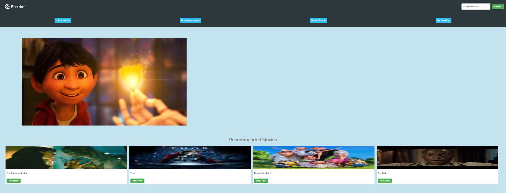
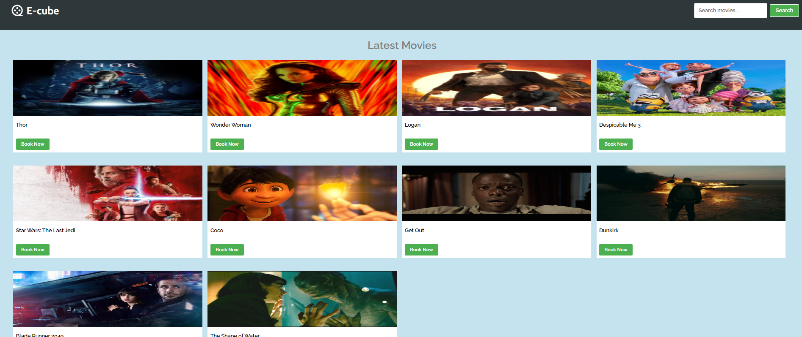
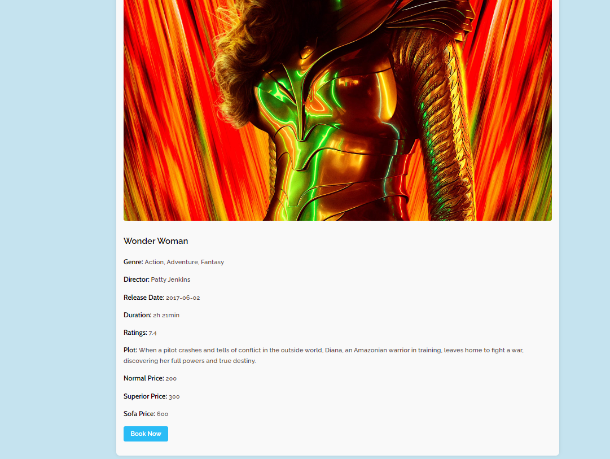
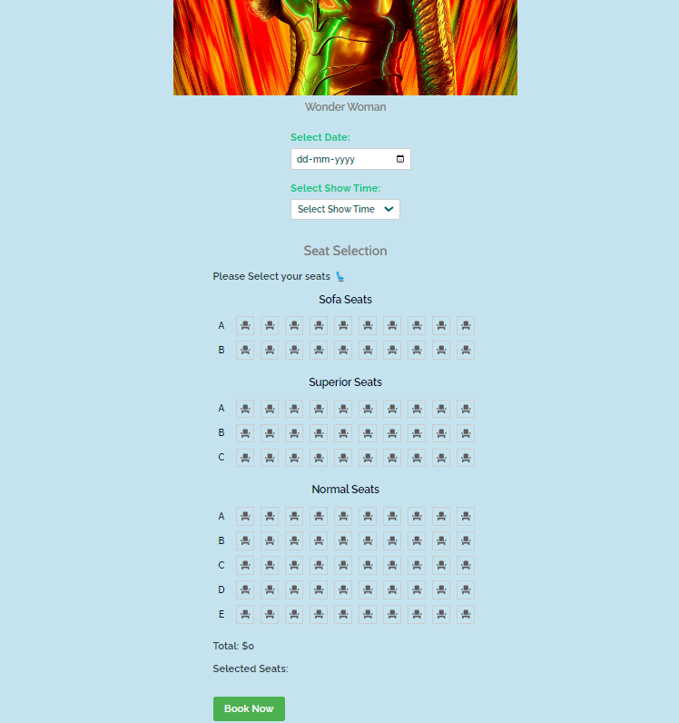

# E-Cube: Online Movie Ticket Booking Web Application

## Overview

**E-Cube** is an advanced web application that allows users to book tickets for the latest movies, concerts, and other live events happening in their city. Originally developed using traditional web development methodologies, E-Cube faced challenges with website load time, tight coupling of UI components, and difficulties in feature updates. To enhance usability, performance, and overall user experience, the application has been upgraded using the **React** library and **Redux** for state management.

## Table of Contents

- [Features](#features)
- [Tech Stack](#tech-stack)
- [Installation](#installation)
- [Usage](#usage)
- [Application Structure](#application-structure)
- [Screenshots](#screenshots)
- [Future Enhancements](#future-enhancements)

## Features

- **Latest Movies:** Displays a list of all new movies currently available in theaters.
- **Movies Details Page:** Provides detailed information about a selected movie, including synopsis, cast, and crew.
- **Ticket Booking Page:** Allows users to select their preferred seats and book tickets for their desired showtime.
- **Final Booking Page:** Generates a QR code with all booking details, which can be scanned by the user's mobile device.
- **Upcoming Movies:** Displays a list of movies that will be released soon.
- **Events:** Includes details of nearby events such as concerts, drama plays, competitions, and other activities happening in the city.

## Tech Stack

**React** - for Frontend
**Redux** - for state management
**CSS** - for styling
**axios** - to make API calls

## Installation

To get a local copy of the project up and running, follow these simple steps:

1. **Clone the repository:**
   `git@github.com:Naveen-Vallamsetty/E-cube-web-app.git`

2. **Navigate to the project directory:**
   `cd e-cube-web-app`

3. **Install the dependencies:**
   `npm install`

4. **Start the development server:**

   Run the JSON server - `npm run server` - to get API endpoints

   To start the project
   `npm start`
   The application will run on `http://localhost:3000`.

## Usage

After starting the development server, you can use the application to:

- Browse the latest movies and events.
- View detailed information about each movie.
- Book tickets by selecting the desired showtime and seats.
- Access your booked tickets via a QR code.

## Application Structure

- **src**
  - **components**: Contains all the React components used in the application.
  - **redux**: Handles the state management using Redux.
  - **Pages**: Includes the pages that are served as web page
  - **styles**: CSS files are used to style the components.
  - **App.js**: The root component that ties everything together.
  - **index.js**: The entry point for the React application.

## Screenshots

- Home Page
  

- Latest Movies Page
  

- Movies Details Page
  

- Ticket Booking Page
  
  

## Future Enhancements

- **Payment Integration:** Adding a payment gateway for online payments.
- **User Authentication:** Implementing login and registration features for personalized user experiences.
- **Seat Selection Improvements:** Enhancing the seat selection process with better UI/UX.
- **Search Functionality:** Adding a search bar to find movies and events quickly.
